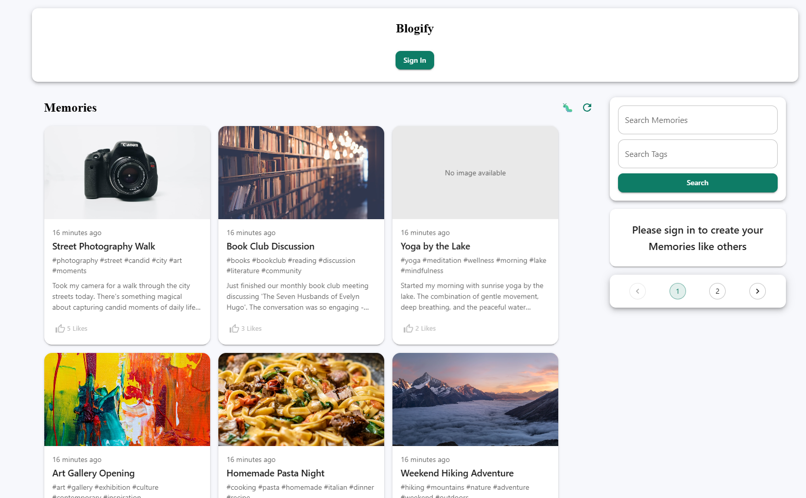
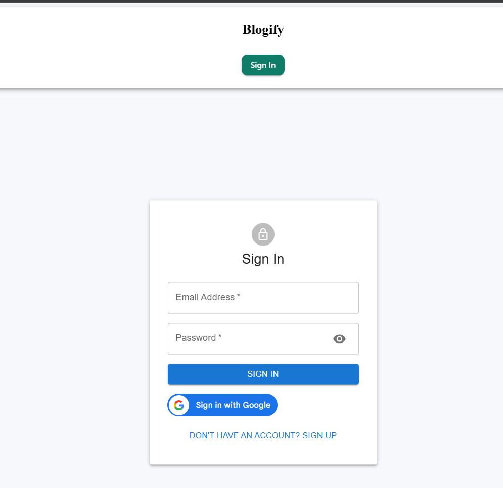

# Memories - Frontend

A modern, responsive social media application built with React that allows users to create, share, and interact with memory posts. The frontend provides an intuitive interface for users to capture and share their life moments with a beautiful, Material-UI powered design.

## ✨ Features

### 🔐 Authentication

- **Google OAuth Integration** - Seamless sign-in with Google accounts
- **JWT Authentication** - Secure token-based authentication
- **Persistent Sessions** - User sessions maintained across browser refreshes
- **Protected Routes** - Secure access to authenticated features

### 📱 Core Functionality

- **Create & Share Posts** - Upload images with titles, messages, and tags
- **Interactive Feed** - Like, comment, and engage with posts
- **Smart Search** - Search posts by title, message content, or tags
- **Pagination** - Efficient loading of large post collections
- **Real-time Updates** - Dynamic content updates without page refresh

### 🎨 User Experience

- **Responsive Design** - Optimized for desktop, tablet, and mobile devices
- **Material Design** - Clean, modern interface following Google's design principles
- **Dark/Light Theme Support** - Customizable color schemes
- **Smooth Animations** - Engaging transitions and micro-interactions
- **Intuitive Navigation** - Easy-to-use routing and navigation system

### 🔧 Advanced Features

- **Image Upload** - Base64 image encoding for seamless file handling
- **Tag System** - Categorize posts with custom tags
- **Comment System** - Threaded discussions on posts
- **Like System** - Express appreciation for posts
- **Post Management** - Edit and delete your own posts
- **Search & Filter** - Find content quickly with advanced search

## 🛠️ Tech Stack

### Core Framework

- **React 18.3.1** - Modern React with hooks and functional components
- **Vite 6.0.5** - Fast build tool and development server
- **React Router DOM 6.28.0** - Client-side routing

### State Management

- **Redux Toolkit 2.5.1** - Predictable state container
- **React Redux 9.2.0** - React bindings for Redux
- **Redux Thunk 3.1.0** - Async action handling
- **Redux Persist 6.0.0** - State persistence across sessions

### UI Framework & Styling

- **Material-UI (MUI) 6.4.3** - Comprehensive React component library
- **MUI Icons 6.4.3** - Extensive icon collection
- **MUI Lab 6.0.0** - Experimental MUI components
- **Emotion** - CSS-in-JS styling solution

### Authentication & Security

- **React OAuth Google 0.12.1** - Google OAuth integration
- **JWT Decode 4.0.0** - JSON Web Token handling
- **Axios 1.7.9** - HTTP client with interceptors

### Utilities

- **Moment.js 2.30.1** - Date manipulation and formatting
- **React File Base64 1.0.3** - File to base64 conversion
- **MUI Chips Input 4.0.1** - Tag input component

## 📁 Project Structure

```
client/
├── public/
│   └── vite.svg                 # Vite logo
├── src/
│   ├── actions/                 # Redux action creators
│   │   ├── auth.js             # Authentication actions
│   │   └── posts.js            # Posts-related actions
│   ├── api/
│   │   └── index.js            # API configuration and endpoints
│   ├── components/              # Reusable React components
│   │   ├── Auth/              # Authentication components
│   │   │   ├── Auth.jsx       # Main auth component
│   │   │   ├── Input.jsx      # Form input component
│   │   │   └── Styles.js      # Auth-specific styles
│   │   ├── Form/              # Post creation/editing
│   │   │   ├── Form.jsx       # Post form component
│   │   │   └── styles.js      # Form styles
│   │   ├── Home/              # Home page components
│   │   │   ├── Home.jsx       # Main home component
│   │   │   └── styles.js      # Home styles
│   │   ├── Navbar/            # Navigation components
│   │   │   ├── Navbar.jsx     # Main navigation
│   │   │   └── styles.js      # Navbar styles
│   │   ├── PostDetails/       # Post detail view
│   │   │   ├── PostDetails.jsx # Post detail component
│   │   │   ├── CommentSection.jsx # Comments component
│   │   │   └── styles.js      # Post detail styles
│   │   ├── Posts/             # Post listing components
│   │   │   ├── Posts.jsx      # Posts container
│   │   │   ├── Post/          # Individual post component
│   │   │   │   ├── Post.jsx   # Single post display
│   │   │   │   └── styles.js  # Post styles
│   │   │   └── styles.js      # Posts container styles
│   │   ├── Pagination.jsx     # Pagination component
│   │   └── styles.js          # Global component styles
│   ├── constants/
│   │   └── actionTypes.js     # Redux action type constants
│   ├── images/                # Static images and assets
│   │   ├── memories-Logo.png  # App logo
│   │   ├── memories-Text.png  # App text logo
│   │   └── memories.png       # App icon
│   ├── reducers/              # Redux reducers
│   │   ├── auth.js           # Authentication reducer
│   │   ├── posts.js          # Posts reducer
│   │   └── index.js          # Root reducer
│   ├── App.jsx               # Main application component
│   ├── main.jsx              # Application entry point
│   └── index.css             # Global styles
├── package.json              # Dependencies and scripts
├── vite.config.js           # Vite configuration
├── eslint.config.js         # ESLint configuration
└── vercel.json              # Vercel deployment configuration
```

## 🚀 Installation & Setup

### Prerequisites

- Node.js (v16 or higher)
- npm or yarn package manager
- Backend API server running (see server documentation)

### 1. Clone the Repository

```bash
git clone <repository-url>
cd Memories-Project/client
```

### 2. Install Dependencies

```bash
npm install
# or
yarn install
```

### 3. Environment Configuration

Create a `.env` file in the client directory:

```env
# API Configuration
VITE_API_BASE_URL=http://localhost:5000

# Google OAuth (Optional - for Google sign-in)
VITE_GOOGLE_CLIENT_ID=your_google_client_id

# Development Configuration
VITE_DEV_MODE=true
```

### 4. Start Development Server

```bash
npm run dev
# or
yarn dev
```

The application will be available at `http://localhost:5173`

### 5. Build for Production

```bash
npm run build
# or
yarn build
```

## 🔧 Environment Variables

| Variable                | Description            | Default                 | Required             |
| ----------------------- | ---------------------- | ----------------------- | -------------------- |
| `VITE_API_BASE_URL`     | Backend API base URL   | `http://localhost:5000` | Yes                  |
| `VITE_GOOGLE_CLIENT_ID` | Google OAuth client ID | -                       | No (for Google auth) |
| `VITE_DEV_MODE`         | Development mode flag  | `false`                 | No                   |

## 📖 Usage Instructions

### Getting Started

1. **Sign Up/Login**: Create an account or sign in with Google
2. **Create Posts**: Click the "Create Memory" button to add new posts
3. **Upload Images**: Select images from your device to accompany posts
4. **Add Tags**: Categorize your posts with relevant tags
5. **Interact**: Like and comment on posts from other users

### Key Features Usage

#### Creating a Post

1. Click the "Create Memory" button in the navigation
2. Fill in the title and message
3. Upload an image (optional but recommended)
4. Add relevant tags separated by commas
5. Click "Submit" to publish

#### Searching Posts

1. Use the search bar in the navigation
2. Enter keywords to search by title or content
3. Use the tag filter to find posts by specific tags
4. Click the refresh button to clear search results

#### Managing Your Posts

1. View your posts in the main feed
2. Click on a post to view details
3. Use the edit button to modify your posts
4. Use the delete button to remove posts

## 📸 Screenshots & Demo

### Home Feed



### Post Creation


### Authentication



### Post Details


_Note: Replace placeholder images with actual screenshots of your application_

## 🚀 Deployment

### Vercel Deployment (Recommended)

1. **Connect to Vercel**:

   ```bash
   npm install -g vercel
   vercel login
   ```

2. **Deploy**:

   ```bash
   vercel --prod
   ```

3. **Environment Variables**:
   - Set `VITE_API_BASE_URL` to your production API URL
   - Set `VITE_GOOGLE_CLIENT_ID` for Google OAuth
   - Configure other environment variables as needed

### Other Deployment Options

#### Netlify

```bash
npm run build
# Upload dist/ folder to Netlify
```

#### GitHub Pages

```bash
npm run build
# Deploy dist/ folder to gh-pages branch
```

## 🔧 Development

### Available Scripts

- `npm run dev` - Start development server
- `npm run build` - Build for production
- `npm run preview` - Preview production build
- `npm run lint` - Run ESLint

### Code Structure

- **Components**: Reusable UI components in `/src/components`
- **Actions**: Redux action creators in `/src/actions`
- **Reducers**: Redux state management in `/src/reducers`
- **API**: HTTP client configuration in `/src/api`
- **Styles**: Component-specific styling with Material-UI

### Best Practices

- Use functional components with hooks
- Implement proper error handling
- Follow Material-UI design guidelines
- Maintain consistent code formatting
- Write reusable components

## 🤝 Contributing

1. Fork the repository
2. Create a feature branch (`git checkout -b feature/amazing-feature`)
3. Commit your changes (`git commit -m 'Add amazing feature'`)
4. Push to the branch (`git push origin feature/amazing-feature`)
5. Open a Pull Request

## 📄 License

This project is licensed under the MIT License - see the [LICENSE](LICENSE) file for details.

## 🆘 Support

For support and questions:

- Create an issue in the repository
- Check the documentation
- Review the code comments for implementation details

---

**Built with ❤️ using React, Material-UI, and modern web technologies**
